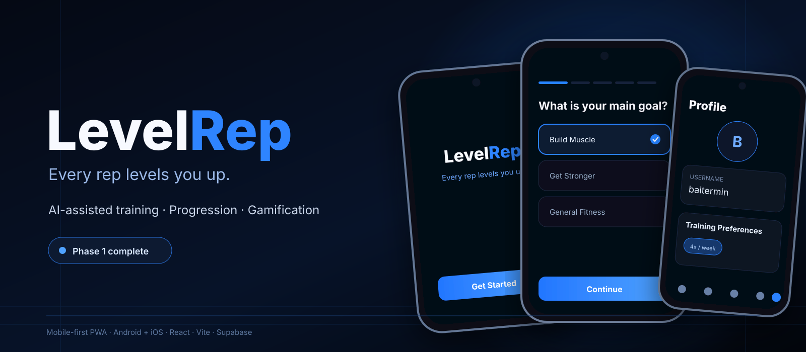
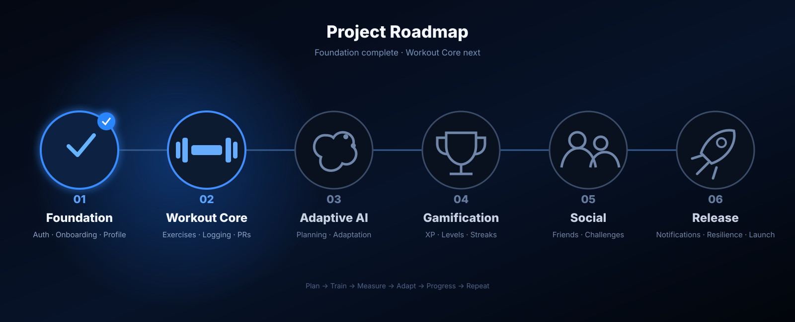

<div align="center">



<br />

# LevelRep

### Every rep levels you up.

A mobile-first Progressive Web App being built around **adaptive training, measurable progression, motivation and social competition**.


</div>

---

## What is LevelRep?

LevelRep is a mobile-first, installable fitness PWA for modern Android and iOS browsers, designed around one long-term training loop:

> **Plan → Train → Measure → Adapt → Progress → Repeat**

The goal is not just to generate workouts. LevelRep is being designed so that future training decisions can build on structured history: previous exercises, sets, reps, load, progression, available equipment, recovery context and consistency.

The full production repository is private while the app is actively developed. This repository is the public showcase for the product direction, architecture, visual language and roadmap.

---

## Current Build — Phase 1


> The artwork above is a public showcase composition based on the current LevelRep design language and implemented Phase 1 flows. It intentionally contains no private backend data or production source code.

**Phase 1 — Foundation is complete.** The current application includes a working mobile foundation backed by a live Supabase project.

### Authentication & identity

- Email/password sign-up and sign-in
- Google OAuth through Supabase Auth
- Persistent authenticated sessions
- Deleted/stale-session verification on startup
- First-time OAuth username setup
- Case-insensitive unique usernames
- Browser/PWA Google OAuth callback through Supabase PKCE

### Onboarding & profile

- Premium dark, one-question-per-screen onboarding
- Resumable user-scoped onboarding drafts
- Goal, experience and training-frequency setup
- Height and weight measurement pickers
- Workout duration and training-environment preferences
- Live equipment selection with Select all / Deselect all
- Muscle-focus preferences with a maximum of four focused areas
- Exercise likes/dislikes and limitations
- Complete review before account setup is finalized
- Editable Profile sections for all onboarding values
- Google profile image fallback + private custom avatar uploads

### Backend & data safety

- Supabase PostgreSQL
- Row Level Security
- Version-controlled SQL migrations
- Transactional onboarding completion
- Private user-owned avatar Storage policies
- Zod client validation mirrored by database constraints
- Canonical metric storage with metric/imperial presentation

### Engineering quality

- Strict TypeScript
- ESLint
- Vitest + Testing Library
- Production PWA build validation
- Installable app shell, service worker and explicit update prompt
- IndexedDB profile cache, onboarding persistence and mutation-outbox foundation
- Automated CI checks
- **128 automated tests passing at the end of the Phase 1 OAuth callback work**

---

## Product Direction

### Workout Core

Phase 2 turns the foundation into a real workout application.

Planned core capabilities include:

- Exercise library
- Manual workout creation
- Planned vs. actual performance
- Warm-up and working sets
- Weight, reps, RIR and optional RPE
- Rest timers
- Exercise substitutions and skipped sets
- Workout history
- Personal-record detection
- Estimated strength metrics
- Basic progress analytics

A major design principle is that planned and performed data remain distinct. For example:

```text
Planned
Bench Press · 80 kg · 3 × 8–10 · 2 RIR

Performed
Set 1 · 80 kg × 10 · 2 RIR
Set 2 · 80 kg × 9  · 1 RIR
Set 3 · 80 kg × 8  · 0 RIR
```

That structured history becomes the foundation for later adaptive programming.

### Adaptive Training

The future training engine is intended to combine deterministic training logic with AI-assisted planning instead of treating an LLM as the database or rules engine.

Planned context includes:

- Training goal and experience
- Selected training days
- Workout duration
- Available equipment
- Recent exercise performance
- Muscle-group exposure
- Progression trends
- Missed workouts
- Readiness and recovery inputs

### Gamification

LevelRep is also designed around motivation as a first-class product feature:

- XP and levels
- Badges and achievements
- PR milestones
- Training streaks
- Challenges
- Friends
- Leaderboards

The intent is to reward meaningful training and consistency rather than simple app engagement.

---

## Roadmap



| Phase | Scope | Status |
| --- | --- | --- |
| **1** | PWA foundation, authentication, onboarding, profile, offline architecture & backend | ✅ Complete |
| **2** | Exercise library, workout logging, history & personal records | 🔵 Next |
| **3** | Adaptive training engine & AI provider layer | ⬜ Planned |
| **4** | XP, levels, achievements & streaks | ⬜ Planned |
| **5** | Friends, challenges & leaderboards | ⬜ Planned |
| **6** | Notifications, resilience polish & public release preparation | ⬜ Planned |

---

## Architecture

```text
Mobile-first Progressive Web App
React + Vite + TypeScript
        │
        ├── React Router
        ├── Design System
        ├── Zustand
        ├── TanStack React Query
        ├── Service Worker
        └── Dexie / IndexedDB
        │
        ▼
Supabase
        │
        ├── Auth
        ├── PostgreSQL
        ├── Row Level Security
        └── Private Storage
        │
        ▼
Future Training Layer
        │
        ├── Deterministic progression logic
        ├── Training-history aggregation
        ├── Validation / constraints
        └── Provider-independent AI planning
```

### PWA client

- **React 19**
- **Vite**
- **TypeScript**
- **React Router**
- **Workbox service worker**
- **Web App Manifest**
- Mobile-first responsive and safe-area-aware UI

### Backend

- **Supabase Auth**
- **PostgreSQL**
- **Row Level Security**
- **Supabase Storage**
- Version-controlled SQL migrations

### State & validation

- **TanStack React Query** for backend state
- **Zustand** for local/ephemeral state
- **Dexie / IndexedDB** for cached entities, onboarding drafts and the offline mutation outbox
- **Zod** for typed client validation

---

## Design Language

LevelRep uses a dark, high-contrast visual system with electric-blue interaction states.

The interface is being designed around:

- Clear single-purpose screens
- Large mobile touch targets
- Minimal friction while training
- Strong selected states
- Compact data presentation
- Dark-mode-first visuals
- Subtle haptics and motion
- Accessibility-aware controls

---

## Privacy & Source Code

The production LevelRep repository is intentionally private while the product is under active development.

This showcase repository contains **no production credentials, OAuth secrets, private Supabase configuration, user data or proprietary application source code**.

The visuals in this repository are public showcase assets created to communicate the product direction and current implemented experience.

---

## Development Status

```text
Phase 1  ████████████████████  COMPLETE
Phase 2  ░░░░░░░░░░░░░░░░░░░░  NEXT
Phase 3  ░░░░░░░░░░░░░░░░░░░░  PLANNED
Phase 4  ░░░░░░░░░░░░░░░░░░░░  PLANNED
Phase 5  ░░░░░░░░░░░░░░░░░░░░  PLANNED
Phase 6  ░░░░░░░░░░░░░░░░░░░░  PLANNED
```

<div align="center">

### Built by [Baitermin](https://github.com/Baitermin)

**LevelRep is actively being developed.**

</div>
